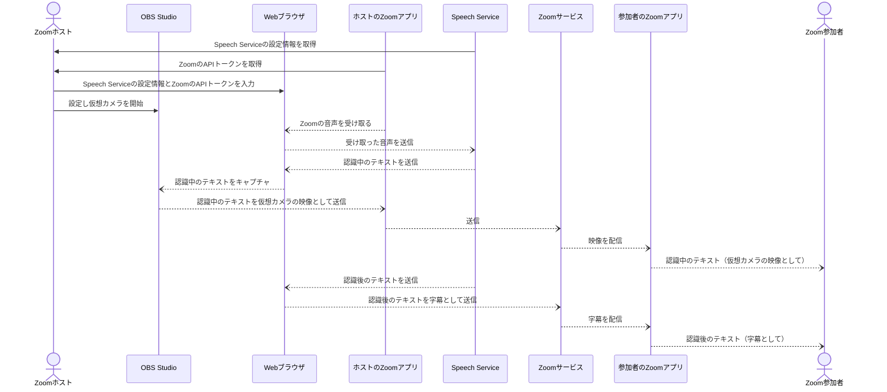
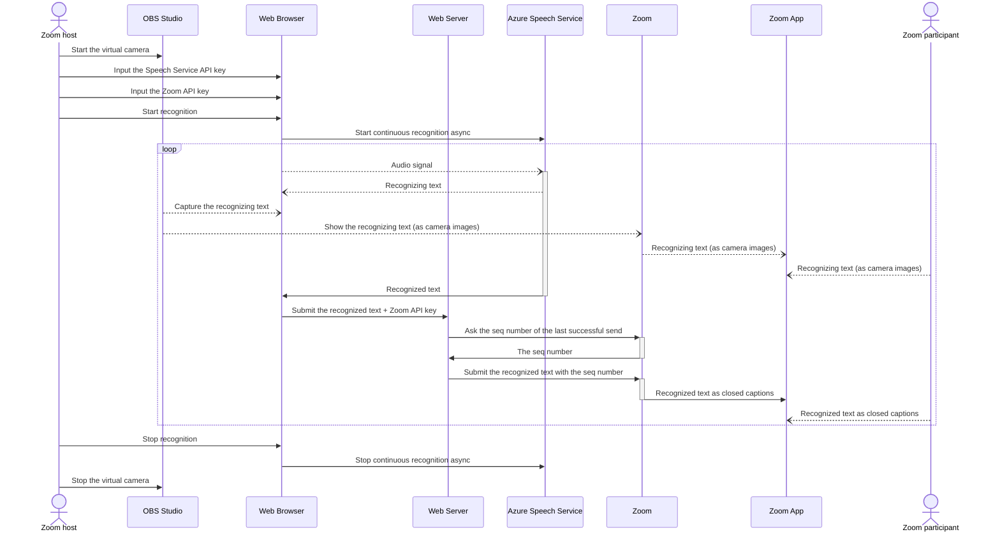

# Minimal Captioning tool for Zoom

## 本ツールについて

音声認識したテキストをZoomの字幕として表示する簡易的なツールです。音声認識を開始すると、認識中のテキストを逐次Webブラウザに表示し、認識が完了する度にZoomの字幕として送信します。Webブラウザの画面をキャプチャして仮想カメラとして会議に参加させることにより、認識中のテキストをほぼリアルタイムで共有できます。なお、あくまで最小限の機能だけを実装した簡易的なものであり、一般向け公開サービスとして使用されることを想定したものではありません。今後の予定についてはTODO.mdをご覧ください。

### 準備

- Webサーバ：本ツールを使用するためにはWebサーバが必要です。手軽にWebアプリケーションをつくれるWebサービス「[Glitch](https://glitch.com/)」を利用すると、簡単に使い始めることができます（[説明](https://help.glitch.com/kb/article/20-importing-code-from-github/)）。
- Microsoft Cognitive Services Speech Serviceのサブスクリプション：Speech Serviceを使い始めるには「[Speech Serviceを無料で試す](https://docs.microsoft.com/ja-jp/azure/cognitive-services/speech-service/overview#try-the-speech-service-for-free)」を参照してください。
- Zoomアプリからブラウザへの音声入力経路：
  - macOSの場合：まず、[BlackHole](https://github.com/ExistentialAudio/BlackHole)の2チャンネル版を導入し、Zoomアプリの［スピーカー］で［BlackHole 2ch］を選択します（同時に内蔵スピーカーなどでも確認したい時は[こちらの記事](https://github.com/ExistentialAudio/BlackHole/wiki/Multi-Output-Device)で説明されている［複数出力装置］が必要です）。次に、Webブラウザの音声入力に関する設定（Chromeの場合には[chrome://settings/content/microphone](chrome://settings/content/microphone)）で同じく［BlackHole 2ch］を選択します。以上で、Zoomアプリの音声がWebブラウザへ入力されるようになります。
- 仮想カメラ：Webブラウザの画面キャプチャを仮想カメラとしてZoomミーティング／ウェビナーに参加させるには、ライブストリーミング用ツール「[OBS Studio](https://obsproject.com/)」などを用意し、設定します。

### 使い方

1. Speech ServiceのSubscription KeyとService Regionを入力する
2. Zoomミーティング／ウェビナーでホストがAPIトークンを取得し（[説明](https://support.zoom.us/hc/ja/articles/115002212983-%E3%82%B5%E3%83%BC%E3%83%89%E3%83%91%E3%83%BC%E3%83%86%E3%82%A3%E3%81%AE%E5%AD%97%E5%B9%95%E3%82%B5%E3%83%BC%E3%83%93%E3%82%B9%E3%81%A8%E3%81%AE%E9%80%A3%E6%90%BA#h_4b01d271-eb7b-473d-b82a-f8bb6eb80ba1)）、取得したAPIトークンを入力する
3. ［音声認識を開始する］ボタンを押して音声認識を開始する

以上で、音声認識が完了する度、Zoomに字幕として投稿されるようになります。なお、音声認識を使用せず、［字幕］欄に入力し［字幕を投稿する］ボタンを押すことにより手動で字幕を投稿することもできます。

### 参考にした記事など

- [Quickstart: Recognize speech in JavaScript on a Web Browser](https://github.com/Azure-Samples/cognitive-services-speech-sdk/tree/master/quickstart/javascript/browser/from-microphone)
- [JavaScript Speech Recognition, Synthesis, and Translation Sample for the Web Browser](https://github.com/Azure-Samples/cognitive-services-speech-sdk/tree/master/samples/js/browser)
- [Cognitive Services Speech SDK for JavaScript](https://docs.microsoft.com/ja-jp/javascript/api/overview/azure/microsoft-cognitiveservices-speech-sdk-readme?view=azure-node-latest)

### 動作確認した環境

- Google Chrome 99.0.4844.83（macOS 12.3）

### 使用しているライブラリ

- [fastify](https://github.com/fastify/fastify)
- [fastify-static](https://github.com/fastify/fastify-static)
- [handlebars.js](https://github.com/handlebars-lang/handlebars.js)
- [point-of-view](https://github.com/fastify/point-of-view)
- [Microsoft Cognitive Services Speech SDK for JavaScript](https://github.com/microsoft/cognitive-services-speech-sdk-js)
- [kuromoji.js](https://github.com/takuyaa/kuromoji.js)

## About this tool

A tiny tool for displaying speech-recognized text as subtitles in Zoom. Once you start speech recognition, your web browser shows the text in recognizing continuously, and the tool submits the final text as Zoom subtitle once recognized. By capturing the web browser screen and involving it in a meeting as a virtual camera, you can share the text in recognizing in near real-time. Please note that this is a small tool with minimal functionality and is not intended for use as a public service. See TODO.md for plans.

### References

- [Quickstart: Recognize speech in JavaScript on a Web Browser](https://github.com/Azure-Samples/cognitive-services-speech-sdk/tree/master/quickstart/javascript/browser/from-microphone)
- [JavaScript Speech Recognition, Synthesis, and Translation Sample for the Web Browser](https://github.com/Azure-Samples/cognitive-services-speech-sdk/tree/master/samples/js/browser)
- [Cognitive Services Speech SDK for JavaScript](https://docs.microsoft.com/ja-jp/javascript/api/overview/azure/microsoft-cognitiveservices-speech-sdk-readme?view=azure-node-latest)

### Libraries

- [fastify](https://github.com/fastify/fastify)
- [fastify-static](https://github.com/fastify/fastify-static)
- [handlebars.js](https://github.com/handlebars-lang/handlebars.js)
- [point-of-view](https://github.com/fastify/point-of-view)
- [Microsoft Cognitive Services Speech SDK for JavaScript](https://github.com/microsoft/cognitive-services-speech-sdk-js)
- [kuromoji.js](https://github.com/takuyaa/kuromoji.js)

