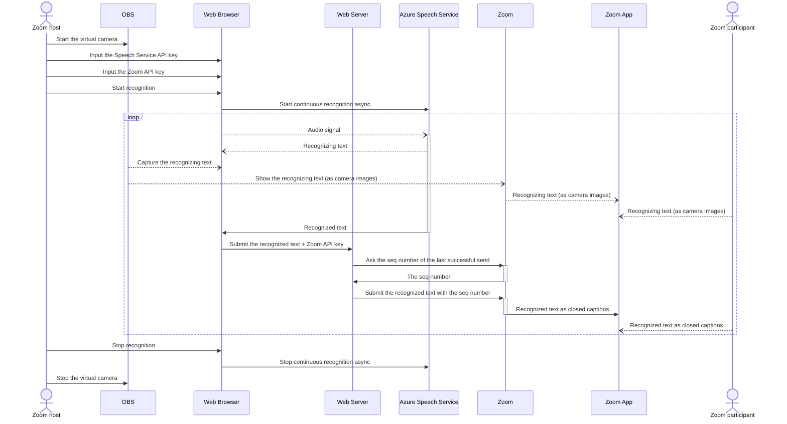

# Minimal Captioning tool for Zoom

## 本ツールについて

Microsoft Cognitive ServicesのSpeech Serviceで音声認識したテキストをZoomの字幕として表示する簡易的なツールです。あくまで最小限の機能だけを実装した簡易的なものであり、一般向け公開サービスとして使用されることを想定したものではありません。今後の予定についてはTODO.mdをご覧ください。

### 参考にした記事など

- [Quickstart: Recognize speech in JavaScript on a Web Browser](https://github.com/Azure-Samples/cognitive-services-speech-sdk/tree/master/quickstart/javascript/browser/from-microphone)
- [JavaScript Speech Recognition, Synthesis, and Translation Sample for the Web Browser](https://github.com/Azure-Samples/cognitive-services-speech-sdk/tree/master/samples/js/browser)
- [Cognitive Services Speech SDK for JavaScript](https://docs.microsoft.com/ja-jp/javascript/api/overview/azure/microsoft-cognitiveservices-speech-sdk-readme?view=azure-node-latest)

## About this tool

A simple tool to display text recognised by the Speech Service of Microsoft Cognitive Services as subtitles in Zoom. Only the minimum functions are implemented, and it is not intended to be used as a public service for general use. See TODO.md for plans.

### References

- [Quickstart: Recognize speech in JavaScript on a Web Browser](https://github.com/Azure-Samples/cognitive-services-speech-sdk/tree/master/quickstart/javascript/browser/from-microphone)
- [JavaScript Speech Recognition, Synthesis, and Translation Sample for the Web Browser](https://github.com/Azure-Samples/cognitive-services-speech-sdk/tree/master/samples/js/browser)
- [Cognitive Services Speech SDK for JavaScript](https://docs.microsoft.com/ja-jp/javascript/api/overview/azure/microsoft-cognitiveservices-speech-sdk-readme?view=azure-node-latest)
