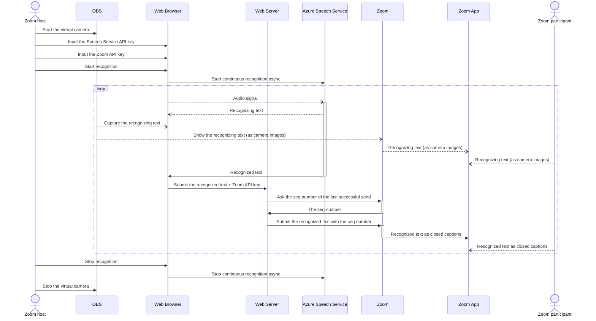

# Minimal Captioning tool for Zoom

## 本ツールについて

Microsoft Cognitive ServicesのSpeech Serviceで音声認識したテキストをZoomの字幕として表示する簡易的なツールです。あくまで最小限の機能だけを実装した簡易的なものであり、一般向け公開サービスとして使用されることを想定したものではありません。今後の予定についてはTODO.mdをご覧ください。

### 使い方

1. Speech ServiceのSubscription KeyとService Regionを入力する（Speech Serviceをはじめて使う場合は「[Speech Serviceを無料で試す](https://docs.microsoft.com/ja-jp/azure/cognitive-services/speech-service/overview#try-the-speech-service-for-free)」を参照）
2. Zoomミーティング／ウェビナーでホストがAPIトークンを取得する（[説明](https://support.zoom.us/hc/ja/articles/115002212983-%E3%82%B5%E3%83%BC%E3%83%89%E3%83%91%E3%83%BC%E3%83%86%E3%82%A3%E3%81%AE%E5%AD%97%E5%B9%95%E3%82%B5%E3%83%BC%E3%83%93%E3%82%B9%E3%81%A8%E3%81%AE%E9%80%A3%E6%90%BA#h_4b01d271-eb7b-473d-b82a-f8bb6eb80ba1)）
3. 取得したAPIトークンを入力する
4. ［音声認識を開始する］ボタンを押す

以上で、音声認識が完了する度、Zoomに字幕として投稿されるようになります。なお、音声認識を使用せず、［字幕］欄に入力し［字幕を投稿する］ボタンを押すことにより手動で字幕を投稿することもできます。

### 参考にした記事など

- [Quickstart: Recognize speech in JavaScript on a Web Browser](https://github.com/Azure-Samples/cognitive-services-speech-sdk/tree/master/quickstart/javascript/browser/from-microphone)
- [JavaScript Speech Recognition, Synthesis, and Translation Sample for the Web Browser](https://github.com/Azure-Samples/cognitive-services-speech-sdk/tree/master/samples/js/browser)
- [Cognitive Services Speech SDK for JavaScript](https://docs.microsoft.com/ja-jp/javascript/api/overview/azure/microsoft-cognitiveservices-speech-sdk-readme?view=azure-node-latest)

## About this tool

A simple tool to display text recognised by the Speech Service of Microsoft Cognitive Services as subtitles in Zoom. Only the minimum functions are implemented, and it is not intended to be used as a public service for general use. See TODO.md for plans.

### References

- [Quickstart: Recognize speech in JavaScript on a Web Browser](https://github.com/Azure-Samples/cognitive-services-speech-sdk/tree/master/quickstart/javascript/browser/from-microphone)
- [JavaScript Speech Recognition, Synthesis, and Translation Sample for the Web Browser](https://github.com/Azure-Samples/cognitive-services-speech-sdk/tree/master/samples/js/browser)
- [Cognitive Services Speech SDK for JavaScript](https://docs.microsoft.com/ja-jp/javascript/api/overview/azure/microsoft-cognitiveservices-speech-sdk-readme?view=azure-node-latest)

